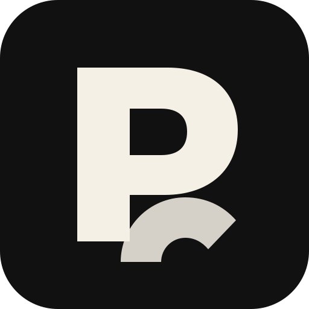

# PosterLoom

**Adaptive Photo-to-Poster Skill** · 自适应照片转海报 Skill

> 读懂照片，自适应风格，把真实场景编织成海报。



---

## 📦 安装

```text
$skill-installer install https://github.com/liuweispace/posterloom/tree/main/posterloom
```

---

## 🧵 这是什么

**PosterLoom** 是一个把真实照片转成艺术海报的 Agent Skill。

它 **不是** 图像生成模型。它负责的是：

- 分析画面场景（主体、空间、光线、色彩、材质、情绪）；
- 保护原图的识别特征（人物脸部、建筑几何、材质、真实文字）；
- 在 29 个直接视觉风格中自动选一种，或在两个明确兼容的风格之间启用受控混合（`Controlled Hybrid`）；
- 重新组织构图；
- 应用克制的小字号排版；
- 按反 AI 套路化清单对结果做 QA。

要生成最终海报，宿主 Agent 需要具备图像生成或图像编辑能力。如果没有，PosterLoom 也会返回完整的路由决策和生成 Prompt。

## 🎨 风格库

PosterLoom 自带 **30 个风格契约**，归属 **7 个家族**。每一种风格都是一套完整的视觉系统：适用条件、主体保留策略、构图方法、光线语言、色彩逻辑、材质表达、排版规则、专属 Prompt 块、专属 Negative Prompt、常见失败模式、验收标准。

### 📷 摄影编辑 — 5 种

适合"还是照片，但已经像海报"的场景。

| 风格 | 适用 |
|---|---|
| Cinematic Editorial（电影编辑） | 叙事感的画面，电影宽幅，杂志封面气质 |
| Moody Night Editorial（夜色编辑） | 低光环境、暖色实用光、深色负空间、文化与私密感 |
| Travel Cover Poster（旅行封面） | 地点 + 季节 + 一个主体，意境大于写实 |
| Luxury Still-Life Editorial（奢华静物） | 产品或器物、高级材质、克制光线 |
| Documentary Poster（纪实海报） | 现场摄影的编辑感，克制胜于装饰 |

### 🖌️ 绘画氛围 — 5 种

把照片推向绘画或氛围媒介。

| 风格 | 适用 |
|---|---|
| Transparent Watercolor（透明水彩） | 安静的旅行、植物、户外 |
| Soft Gouache（柔和水粉） | 儿童、动物、暖色室内、轻盈色彩 |
| Expressive Painting（表现绘画） | 主体明确且情绪强烈，允许看见笔触 |
| Ink Wash Minimal（水墨极简） | 单个主体、大面积留白、诗意 |
| Pastel Atmosphere（粉彩氛围） | 柔光日景、梦境感、时尚 / 静物情绪 |

### 🖨️ 印刷图形 — 5 种

海报化、制版感、中世纪或 Riso 美学。

| 风格 | 适用 |
|---|---|
| Pop Screenprint（波普丝网） | 高反差主体、平面色、强海报感 |
| Riso Poster（Riso 海报） | 轻微错位、有限色板、独立 zine 调性 |
| Relief Print（凸版印刷） | 木刻 / 麻版质感、手作纹理 |
| Retro Lithograph（复古石印） | 复古编辑 / 旅行海报、叠层石印感 |
| Paper-Cut Graphic（剪纸图形） | 大块形状、插画化主体、叙事场景 |

### 🏯 东方 / 文化 — 5 种

主体本身与中式、日式或更广泛的东亚视觉文化相关。

| 风格 | 适用 |
|---|---|
| Neo Ink Poster（新水墨） | 现代水墨构图、大负空间、克制排版 |
| Tea-House Minimal（茶室极简） | 茶、木、夜色室内、文化静谧 |
| Classical Parchment（古典羊皮卷） | 书法或文学性主体、暖旧纸张 |
| Seal & Calligraphy Poster（印章与书法） | 主体配真实或风格化的印章 / 文字 |
| Folk Narrative Color（民间叙事色彩） | 民间工艺色板、叙事场景、慷慨配色 |

### 🌀 概念编辑 — 4 种

把照片变成一个概念性或编辑性表达。

| 风格 | 适用 |
|---|---|
| Editorial Surrealism（编辑超现实） | 强主体 + 一个被置换的概念元素 |
| Abstract Editorial（抽象编辑） | 把主体收敛为形状 / 色块、杂志封面逻辑 |
| Minimal Symbolic Poster（极简符号） | 一个主体，近似当作单一符号 |
| Collage-Lite Narrative（轻拼贴叙事） | 两个叠加的概念，但视觉保持干净（不是 moodboard） |

### 🧱 现代设计 — 5 种

根植于 20 / 21 世纪设计语言。

| 风格 | 适用 |
|---|---|
| Swiss Grid Poster（瑞士网格） | 强网格、无衬线、几何色 |
| Brutalist Poster（粗野主义） | 粗砺、巨大、非对称、反"漂亮" |
| Neo-Futurist Layout（新未来布局） | 建筑感主体、技术线条语言 |
| Geometric Color-Block（几何色块） | 强色彩 / 时尚 / 建筑主体、平面色 |
| Elegant Serif Poster（优雅衬线） | 杂志封面、时尚、美学、高端 |

### 🧬 元风格 — 1 种

| 风格 | 适用 |
|---|---|
| Controlled Hybrid（受控混合） | 两个直接风格排名接近且明确兼容；二级风格只允许控制一个子系统（排版 / 负空间 / 印刷质感 / 墨边 / 网格 / 分色 / 氛围）。默认 ≈ 80% 主风格 + 20% 次风格。不允许 50/50 平均。 |

## 🧭 路由流程

1. 读取原图，建立 **Scene Map**——主体、光线、色板、情绪、几何、材质、安全排版区、写实程度。
2. 锁定 **Identity Anchors**——这些特征必须在任何风格下保留。
3. 对 29 个直接风格打分。
4. 取最高分风格。如果允许、且第二名与之明确兼容，才激活 `Controlled Hybrid`。
5. 只加载当前风格的契约——一次性不读全部 30 份。
6. 编译最终 Prompt 与 Negative Prompt。
7. 生成一张海报，跑 **Anti-Slop QA**（禁止蓝紫渐变、随机雾、假胶片边框、虚构地标等）。

---

## 🗂️ 项目架构

```text
PosterLoom/
├── README.md
├── README.en.md
├── README.zh-CN.md
├── LICENSE
├── CHANGELOG.md
├── VERSION
├── CODE_OF_CONDUCT.md
├── CONTRIBUTING.md
├── SECURITY.md
└── posterloom/
    ├── SKILL.md
    ├── styles/          # 30 个 Style Contract
    ├── references/      # 渐进式加载的规范
    ├── data/            # 路由 + 兼容性数据
    ├── scripts/         # 确定性辅助脚本
    ├── evals/           # 路由回归 + 视觉打分模板
    ├── schemas/
    ├── examples/
    └── assets/
```

---

## ⚖️ License

MIT License。

仓库代码和 PosterLoom 原创 Skill 内容按 MIT 发布。

用户自己的原始照片、第三方素材以及最终生成图片的权利，仍然取决于照片本身、相关素材许可，以及所使用图像生成服务的条款。